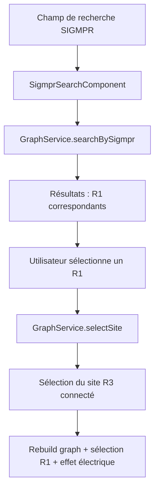
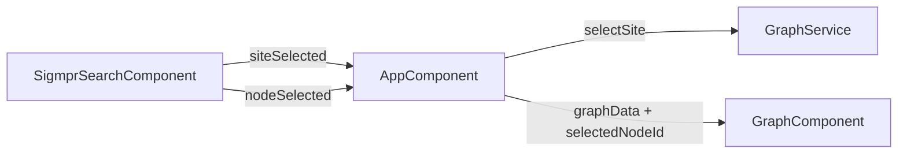

# Étude — Recherche et sélection de site par SIGMPR ID

**Date :** 2026-05-26
**Fichier :** 2026_05_26_Etude_Recherche_SIGMPR.md

---

## 1. Objectif

Ajouter un champ de recherche dans l'interface permettant de rechercher un site par son **SIGMPR ID** (6 chiffres, ex : `750101`). La sélection d'un résultat active le site correspondant dans le graphe, avec l'effet « courant électrique » sur les liaisons connectées au nœud R1 portant ce SIGMPR, et ce quel que soit le mode de vue actif (Force, Arborescence, Dendrogramme).

---

## 2. Contexte métier

### 2.1 Données existantes

| Entité | Champ SIGMPR | Exemples |
|---|---|---|
| **SITE (R3)** | ❌ Absent | — |
| **R1** | ✅ `sigmpr` (6 chiffres) | `750101`, `690101`, `130101`… |
| **R2** | ❌ Absent | — |

Le SIGMPR est un identifiant métier propre aux sites R1. Chaque site R3 (SITE) est connecté à **exactement un R1** par un lien d'**ANIMATION**. La relation est :

```
SITE R3  ──ANIMATION──►  R1 (sigmpr: "750101")
```

### 2.2 Cas d'usage

L'utilisateur tape un SIGMPR (complet ou partiel) → le système recherche les R1 correspondants → l'utilisateur sélectionne un résultat → le site R3 connecté à ce R1 via un lien d'animation est sélectionné dans le graphe → l'effet électrique s'active sur les liaisons du nœud R1.

---

## 3. Architecture proposée

### 3.1 Vue d'ensemble



### 3.2 Composants à créer / modifier

| Composant | Action | Détails |
|---|---|---|
| `SigmprSearchComponent` | **Créer** | Champ de saisie + liste déroulante d'autocomplétion |
| `GraphService` | **Modifier** | Ajouter méthode `searchBySigmpr()` + logique de sélection |
| `AppComponent` | **Modifier** | Intégrer le nouveau composant dans le header |
| `app.component.html` | **Modifier** | Ajouter `<app-sigmpr-search>` dans le header |

---

## 4. Composant `SigmprSearchComponent`

### 4.1 Spécification fonctionnelle

| Comportement | Détail |
|---|---|
| **Saisie** | Champ `<input>` de type texte, filtrage en temps réel après 2+ caractères |
| **Recherche** | Correspondance partielle insensible à la casse sur le champ `sigmpr` des nœuds R1 |
| **Résultats** | Liste déroulante sous le champ, affichant `SIGMPR : 750101 — Site R1 Île-de-France` et le nom du site R3 parent entre parenthèses |
| **Sélection** | Clic sur un résultat → sélectionne le site R3 parent dans le dropdown existant + sélectionne le nœud R1 dans le graphe |
| **Fermeture** | Clic en dehors ou Escape → ferme la liste |
| **Clear** | Bouton ✕ pour vider le champ de recherche |

### 4.2 Template proposé

```html
<div class="relative">
  <label for="sigmpr-search" class="text-sm font-medium text-gray-700">
    SIGMPR :
  </label>
  <div class="relative">
    <input
      id="sigmpr-search"
      type="text"
      placeholder="Rechercher un SIGMPR…"
      [(ngModel)]="searchTerm"
      (input)="onSearch()"
      (keydown.escape)="clearSearch()"
      class="block w-full sm:w-48 rounded-md border-gray-300 shadow-sm
             focus:border-blue-500 focus:ring-blue-500 text-sm py-2 px-3 pr-8 border bg-white"
    />
    <button
      *ngIf="searchTerm"
      (click)="clearSearch()"
      class="absolute right-2 top-1/2 -translate-y-1/2 text-gray-400 hover:text-gray-600"
    >
      ✕
    </button>
  </div>

  <!-- Dropdown des résultats -->
  <div
    *ngIf="results.length > 0 && showDropdown"
    class="absolute z-50 mt-1 w-72 bg-white rounded-md shadow-lg border border-gray-200
           max-h-60 overflow-y-auto"
  >
    <button
      *ngFor="let result of results"
      (click)="onSelect(result)"
      class="w-full text-left px-3 py-2 hover:bg-blue-50 text-sm border-b border-gray-100 last:border-b-0"
    >
      <span class="font-mono font-semibold">{{ result.sigmpr }}</span>
      <span class="text-gray-600"> — {{ result.r1Label }}</span>
      <div class="text-xs text-gray-400">({{ result.siteLabel }})</div>
    </button>
  </div>
</div>
```

### 4.3 Interface du résultat de recherche

```typescript
export interface SigmprSearchResult {
  sigmpr: string;       // ex: "750101"
  r1Id: string;         // ex: "r1-1"
  r1Label: string;      // ex: "Site R1 Île-de-France"
  siteId: string;       // ex: "site-1" (le SITE R3 connecté via ANIMATION)
  siteLabel: string;    // ex: "Site Paris"
}
```

### 4.4 Logique de recherche

```typescript
onSearch(): void {
  const term = this.searchTerm.trim();
  this.showDropdown = true;
  if (term.length < 2) {
    this.results = [];
    return;
  }
  this.results = this.graphService.searchBySigmpr(term);
}

onSelect(result: SigmprSearchResult): void {
  this.searchTerm = result.sigmpr;
  this.showDropdown = false;
  // 1. Sélectionner le site R3 parent
  this.siteSelected.emit(result.siteId);
  // 2. Sélectionner le nœud R1 dans le graphe (effet électrique)
  this.nodeSelected.emit(result.r1Id);
}

clearSearch(): void {
  this.searchTerm = '';
  this.results = [];
  this.showDropdown = false;
}
```

---

## 5. Modifications du `GraphService`

### 5.1 Nouvelle méthode `searchBySigmpr()`

```typescript
searchBySigmpr(term: string): SigmprSearchResult[] {
  const lowerTerm = term.toLowerCase();
  // Trouver les R1 dont le SIGMPR contient le terme de recherche
  const matchingR1s = this.allNodes.filter(
    (n) => n.type === 'R1' && n.sigmpr && n.sigmpr.toLowerCase().includes(lowerTerm)
  );

  return matchingR1s.map((r1) => {
    // Trouver le site R3 connecté à ce R1 via un lien d'ANIMATION
    const animEdge = this.allEdges.find(
      (e) => e.target === r1.id && e.type === 'ANIMATION'
    );
    const site = animEdge
      ? this.allNodes.find((n) => n.id === animEdge.source)
      : null;

    return {
      sigmpr: r1.sigmpr!,
      r1Id: r1.id,
      r1Label: r1.label,
      siteId: site?.id ?? '',
      siteLabel: site?.label ?? 'Site inconnu',
    };
  });
}
```

### 5.2 Flux de sélection

Quand l'utilisateur sélectionne un résultat SIGMPR :

1. **`selectSite(siteId)`** — Change le site sélectionné (déclenche `rebuildGraph()`)
2. **`selectedNodeId`** — Le composant graph sélectionne le nœud R1 correspondant (déclenche `applyNodeSelection()` + effet électrique)

Le défi est de faire communiquer la sélection de nœud R1 du `SigmprSearchComponent` vers le `GraphComponent`. Deux options :

### Option A : Communication via `AppComponent` (recommandé)



- `SigmprSearchComponent` émet deux événements : `siteSelected` et `nodeSelected`
- `AppComponent` appelle `graphService.selectSite(siteId)` pour changer de site
- `AppComponent` passe le `nodeSelected` au `GraphComponent` via un `@Input`

### Option B : Service dédié

Créer un `SelectionService` avec un `BehaviorSubject<string | null>` pour le nœud sélectionné. Plus propre pour les communications inter-composants, mais plus de plumbing.

**Recommandation : Option A** — Plus simple, cohérente avec l'architecture existante.

---

## 6. Modifications du `GraphComponent`

### 6.1 Nouvel `@Input`

```typescript
@Input() selectedNodeIdBySearch: string | null = null;
```

### 6.2 Détection du changement

Dans `ngOnChanges`, si `selectedNodeIdBySearch` change et est non-null :

```typescript
if (changes['selectedNodeIdBySearch'] && this.selectedNodeIdBySearch) {
  this.selectedNodeId = this.selectedNodeIdBySearch;
  this.applyNodeSelection();
}
```

Cela active l'effet électrique sur les liaisons connectées au nœud R1 spécifié, quel que soit le mode de vue (Force, Arborescence, Dendrogramme).

---

## 7. Modifications du `AppComponent`

### 7.1 Nouvelles propriétés et méthodes

```typescript
selectedNodeIdBySearch: string | null = null;

onSigmprSiteSelect(siteId: string): void {
  this.graphService.selectSite(siteId);
}

onSigmprNodeSelect(nodeId: string): void {
  this.selectedNodeIdBySearch = nodeId;
  // Réinitialiser après un délai pour permettre les changements futurs
  setTimeout(() => { this.selectedNodeIdBySearch = null; }, 100);
}
```

### 7.2 Template

Ajout dans le header, entre le site-selector et le layout-selector :

```html
<app-sigmpr-search
    (siteSelected)="onSigmprSiteSelect($event)"
    (nodeSelected)="onSigmprNodeSelect($event)"
></app-sigmpr-search>
```

Et mise à jour du `<app-graph>` :

```html
<app-graph
    [graphData]="graphData"
    [layoutMode]="selectedLayoutMode"
    [selectedNodeIdBySearch]="selectedNodeIdBySearch"
    class="absolute inset-0"
></app-graph>
```

---

## 8. Responsive

Le champ de recherche SIGMPR s'intègre dans le header existant, qui est déjà responsive (`flex-col sm:flex-row`). Sur mobile, les éléments s'empilent verticalement. Le dropdown de résultats a une largeur fixe (`w-72`) qui fonctionne sur tous les écrans.

---

## 9. Plan d'implémentation

| Étape | Fichier | Action |
|---|---|---|
| 1 | `models/graph.model.ts` | Ajouter l'interface `SigmprSearchResult` |
| 2 | `services/graph.service.ts` | Ajouter la méthode `searchBySigmpr()` |
| 3 | `components/sigmpr-search/` | Créer le composant `SigmprSearchComponent` |
| 4 | `components/graph/graph.component.ts` | Ajouter `@Input() selectedNodeIdBySearch` + logique dans `ngOnChanges` |
| 5 | `app.component.ts` + `app.component.html` | Intégrer le composant de recherche + wiring |
| 6 | `Doc/` | Documentation des modifications |

---

## 10. Risques et points d'attention

| Risque | Mitigation |
|---|---|
| SIGMPR en doublon dans les données mock | Les données mock actuelles n'ont pas de doublons, mais le code doit les gérer (afficher plusieurs résultats) |
| R1 sans SIGMPR | Filtrer les R1 sans `sigmpr` dans la recherche |
| R1 sans lien d'ANIMATION | Gérer le cas où un R1 n'est connecté à aucun site (afficher « Site inconnu ») |
| Sélection de nœud après changement de site | Le `selectedNodeIdBySearch` doit être passé APRÈS que le graphe est reconstruit avec le nouveau site |
| Compatibilité avec les 3 modes de vue | L'effet électrique fonctionne déjà dans les 3 modes (Force, Arborescence, Dendrogramme) grâce à `applyNodeSelection()` |