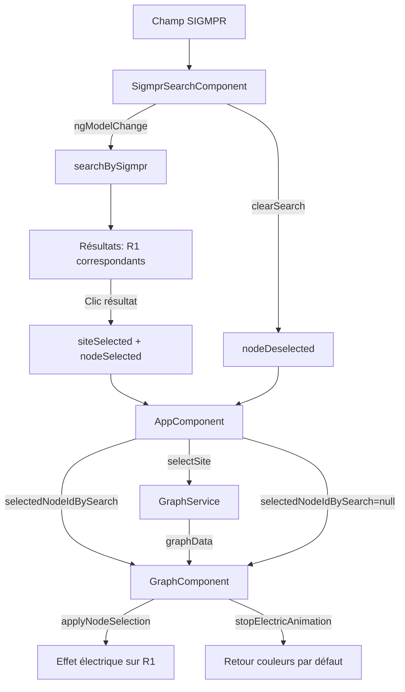

# Journal des modifications — COP Links Visualization

**Date :** 2026-05-26
**Fichier :** 2026_05_26_Modifications_3.md

---

## Résumé

Deux séries de modifications ont été apportées lors de cette session :

1. **Ajout du composant de recherche par SIGMPR** — Champ de recherche avec autocomplétion permettant de rechercher un site R1 par son identifiant SIGMPR, de naviguer vers le site R3 parent et de sélectionner le nœud R1 avec effet électrique
2. **Correction de deux bugs** — Dropdown perdant sa sélection lors d'une recherche SIGMPR (site parent introuvable pour les R1 sans lien ANIMATION), et autocomplétion incomplète (timing `ngModel` vs `input`)

---

## 1. Ajout du composant de recherche par SIGMPR

### Modèle de données

**Fichier :** `src/app/models/graph.model.ts`

Ajout de l'interface `SigmprSearchResult` :

```typescript
export interface SigmprSearchResult {
  sigmpr: string;       // ex: "750101"
  r1Id: string;         // ex: "r1-1"
  r1Label: string;      // ex: "Site R1 Île-de-France"
  siteId: string;       // ex: "site-1" (le SITE R3 connecté)
  siteLabel: string;    // ex: "Site Paris"
}
```

### Service GraphService

**Fichier :** `src/app/services/graph.service.ts`

Ajout de la méthode `searchBySigmpr(term: string): SigmprSearchResult[]` :

- Recherche insensible à la casse sur le champ `sigmpr` des nœuds R1
- Recherche du site parent via un lien ANIMATION (priorité)
- Fallback : recherche du site parent via un lien LOGISTICS quand aucun lien ANIMATION n'existe
- Filtrage des résultats sans site parent (`siteId !== ""`)

```typescript
searchBySigmpr(term: string): SigmprSearchResult[] {
  const lowerTerm = term.toLowerCase();
  const matchingR1s = this.allNodes.filter(
    (n) => n.type === "R1" && n.sigmpr && n.sigmpr.toLowerCase().includes(lowerTerm),
  );

  return matchingR1s
    .map((r1) => {
      // ANIMATION edge first
      const animEdge = this.allEdges.find(
        (e) => e.target === r1.id && e.type === "ANIMATION",
      );
      let site = animEdge
        ? this.allNodes.find((n) => n.id === animEdge.source) ?? null
        : null;

      // LOGISTICS fallback
      if (!site) {
        const logisticsEdge = this.allEdges.find(
          (e) => e.target === r1.id && e.type === "LOGISTICS",
        );
        site = logisticsEdge
          ? this.allNodes.find((n) => n.id === logisticsEdge.source) ?? null
          : null;
      }

      return { sigmpr: r1.sigmpr!, r1Id: r1.id, r1Label: r1.label,
               siteId: site?.id ?? "", siteLabel: site?.label ?? "Site inconnu" };
    })
    .filter((r) => r.siteId !== "");
}
```

### Nouveau composant SigmprSearchComponent

**Fichier :** `src/app/components/sigmpr-search/sigmpr-search.component.ts`

| Propriété | Type | Rôle |
|---|---|---|
| `searchTerm` | `string` | Terme de recherche saisi |
| `results` | `SigmprSearchResult[]` | Résultats de l'autocomplétion |
| `showDropdown` | `boolean` | Visibilité du dropdown |
| `@Output() siteSelected` | `EventEmitter<string>` | Émet l'ID du site R3 parent |
| `@Output() nodeSelected` | `EventEmitter<string>` | Émet l'ID du nœud R1 sélectionné |
| `@Output() nodeDeselected` | `EventEmitter<void>` | Émis quand le champ est effacé |

| Comportement | Détail |
|---|---|
| **Saisie** | Champ `<input>`, filtrage en temps réel après 2+ caractères via `(ngModelChange)` |
| **Recherche** | Correspondance partielle insensible à la casse sur le champ `sigmpr` des nœuds R1 |
| **Résultats** | Dropdown sous le champ : `SIGMPR — Label R1` + nom du site parent entre parenthèses |
| **Sélection** | Clic sur un résultat → émet `siteSelected` (navigation vers le site) + `nodeSelected` (sélection du nœud R1 + effet électrique) |
| **Désélection** | Clic ✕ ou Escape → `clearSearch()` émet `nodeDeselected` → désélection du nœud + arrêt de l'effet électrique |
| **Fermeture** | Clic en dehors du composant → ferme le dropdown |
| **Focus** | Clic dans le champ → rouvre le dropdown si des résultats existent |

### Composant GraphComponent

**Fichier :** `src/app/components/graph/graph.component.ts`

#### Nouvel `@Input`

```typescript
@Input() selectedNodeIdBySearch: string | null = null;
```

#### Logique dans `ngOnChanges`

| Changement détecté | Comportement |
|---|---|
| `graphData` change | Rebuild complet + si `selectedNodeIdBySearch` est défini, sélection du nœud R1 avec effet électrique |
| `selectedNodeIdBySearch` passe à une valeur non-null | Sélection du nœud R1 + activation effet électrique (sans rebuild) |
| `selectedNodeIdBySearch` passe à `null` | Désélection du nœud + arrêt de l'effet électrique + `applyNodeSelection()` pour transition de retour aux couleurs par défaut |

```typescript
} else if (changes["selectedNodeIdBySearch"]) {
  if (this.selectedNodeIdBySearch) {
    this.selectedNodeId = this.selectedNodeIdBySearch;
    this.applyNodeSelection();
  } else {
    this.selectedNodeId = null;
    this.stopElectricAnimation();
    this.applyNodeSelection();
  }
}
```

### Composant AppComponent

**Fichier :** `src/app/app.component.ts` + `src/app/app.component.html`

| Modification | Détail |
|---|---|
| Import `SigmprSearchComponent` | Ajouté dans les imports du composant |
| Propriété `selectedNodeIdBySearch` | `string | null = null` — passe l'ID du nœud R1 au GraphComponent |
| Méthode `onSigmprSiteSelect(siteId)` | Appelle `graphService.selectSite(siteId)` pour naviguer vers le site parent |
| Méthode `onSigmprNodeSelect(nodeId)` | Met à jour `selectedNodeIdBySearch` pour activer la sélection dans le graphe |
| Méthode `onSigmprNodeDeselect()` | Met `selectedNodeIdBySearch` à `null` pour désélectionner le nœud |
| Template header | Ajout de `<app-sigmpr-search>` entre le layout-selector et la fin du header |
| Template graph | Ajout de `[selectedNodeIdBySearch]="selectedNodeIdBySearch"` sur `<app-graph>` |

### Architecture du flux



---

## 2. Corrections de bugs

### 2.1 Dropdown perdant sa sélection lors d'une recherche SIGMPR

**Fichier :** `src/app/services/graph.service.ts` — méthode `searchBySigmpr()`

#### Problème

Sur les 20 nœuds R1, seuls 6 (`r1-1` à `r1-6`) ont un lien ANIMATION vers un site parent. Les 14 autres (`r1-7` à `r1-20`) n'ont que des liens LOGISTICS. Quand la recherche SIGMPR trouvait un R1 sans lien ANIMATION, la méthode retournait `siteId: ""` et `siteLabel: "Site inconnu"`. La sélection de ce résultat appelait `graphService.selectSite("")`, ce qui :

1. Mettait `selectedSiteId$` à `""` → le sélecteur de site montrait une valeur vide
2. `rebuildGraph()` ne trouvait aucun site avec id `""` → `graphData$` émettait `null` → le graphe se vidait
3. Les dropdowns perdaient visuellement leur sélection

#### Solution

Ajout d'un fallback LOGISTICS dans `searchBySigmpr()` : quand aucun lien ANIMATION ne connecte le R1 à un site parent, la méthode cherche un lien LOGISTICS à la place. Les résultats sans site parent sont filtrés.

**Avant :**

```typescript
const animEdge = this.allEdges.find(
  (e) => e.target === r1.id && e.type === "ANIMATION",
);
const site = animEdge
  ? this.allNodes.find((n) => n.id === animEdge.source)
  : null;
```

**Après :**

```typescript
// ANIMATION edge first
const animEdge = this.allEdges.find(
  (e) => e.target === r1.id && e.type === "ANIMATION",
);
let site = animEdge
  ? this.allNodes.find((n) => n.id === animEdge.source) ?? null
  : null;

// LOGISTICS fallback
if (!site) {
  const logisticsEdge = this.allEdges.find(
    (e) => e.target === r1.id && e.type === "LOGISTICS",
  );
  site = logisticsEdge
    ? this.allNodes.find((n) => n.id === logisticsEdge.source) ?? null
    : null;
}
```

#### Résultat sur les données mock

| R1 | SIGMPR | Site parent (avant) | Site parent (après) |
|---|---|---|---|
| r1-1 à r1-6 | 750101, 690101, 130101, 310101, 330101, 920101 | Via ANIMATION ✅ | Via ANIMATION ✅ (inchangé) |
| r1-7 | 750201 | ❌ Site inconnu | ✅ Site Paris (via LOGISTICS site-1→r1-7) |
| r1-8 à r1-20 | 440101…630101 | ❌ Site inconnu | ✅ Site Paris (via LOGISTICS site-1→r1-x) |

Les 20 nœuds R1 ont désormais un site parent valide dans les résultats de recherche.

### 2.2 Autocomplétion incomplète

**Fichier :** `src/app/components/sigmpr-search/sigmpr-search.component.ts`

#### Problème

L'événement `(input)="onSearch()"` se déclenchait potentiellement avant que `[(ngModel)]="searchTerm"` n'ait mis à jour `searchTerm`. Dans ce cas, `onSearch()` utilisait l'ancienne valeur de `searchTerm` et la recherche pouvait manquer des résultats ou utiliser un terme en retard d'un caractère.

#### Solution

Remplacement de `(input)="onSearch()"` par `(ngModelChange)="onSearch()"`. L'événement `ngModelChange` est émis par la directive `NgModel` après avoir mis à jour le modèle, garantissant que `searchTerm` est à jour au moment de la recherche.

**Avant :**

```html
<input
  [(ngModel)]="searchTerm"
  (input)="onSearch()"
/>
```

**Après :**

```html
<input
  [(ngModel)]="searchTerm"
  (ngModelChange)="onSearch()"
/>
```

---

## Fichiers modifiés

| Fichier | Modifications |
|---|---|
| `src/app/models/graph.model.ts` | Ajout interface `SigmprSearchResult` |
| `src/app/services/graph.service.ts` | Méthode `searchBySigmpr()` avec fallback LOGISTICS + filtrage résultats sans site parent |
| `src/app/components/sigmpr-search/sigmpr-search.component.ts` | **Nouveau** — Composant de recherche par SIGMPR avec autocomplétion |
| `src/app/components/graph/graph.component.ts` | `@Input() selectedNodeIdBySearch` + logique sélection/désélection dans `ngOnChanges` |
| `src/app/app.component.ts` | Import `SigmprSearchComponent`, propriété `selectedNodeIdBySearch`, méthodes `onSigmprSiteSelect`, `onSigmprNodeSelect`, `onSigmprNodeDeselect` |
| `src/app/app.component.html` | `<app-sigmpr-search>` dans le header, `[selectedNodeIdBySearch]` sur `<app-graph>` |