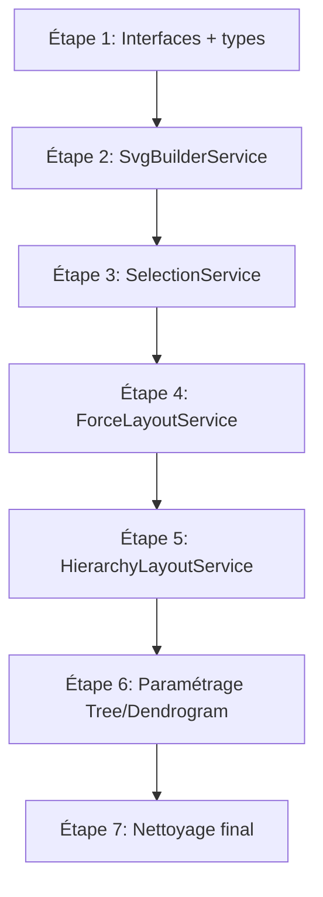
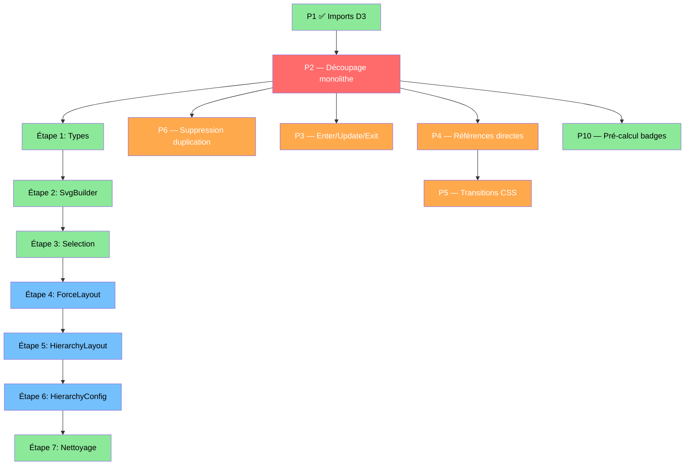

# Plan P2 — Découpage du composant monolithe

**Date :** 2026-05-26
**Fichier :** `Doc/2026_05_26_Plan_Decoupage_P2.md`
**Priorité :** 🔴 Critique
**Objectif :** Réduire `graph.component.ts` de ~3 373 lignes à < 800 lignes, supprimer la duplication Tree/Dendrogram.
**Dernière MAJ :** 2026-05-26 (Étapes 1-3 ✅)

---

## 🏆 Objectif qualité : PLATINIUM

Chaque étape de ce plan doit respecter les critères **Platinium** avant de passer à la suivante :

| Critère | Description |
|---|---|
| **Code production-ready** | Aucun `any` non justifié, aucun `eslint-disable`, typage strict sur toutes les méthodes publiques et privées |
| **Zéro régression visuelle** | Les 3 modes (Force, Arborescence, Dendrogramme) doivent être testés visuellement après chaque étape |
| **Zéro dette technique résiduelle** | Pas de code mort en commentaire, pas de duplication résiduelle entre les layouts |
| **Performance mesurée** | Les métriques (bundle size, temps de rendu) sont consignées dans le suivi d'avancement |
| **Documentation à jour** | Le journal des modifications (`Doc/`) est mis à jour à chaque étape terminée |
| **Tests** | Les cas critiques sont couverts : rendu des 3 layouts, sélection R1/R2 avec effet électrique, recherche SIGMPR, collapse/expand, transitions entre modes |

**Barème P2 :** `graph.component.ts` < 800 lignes, 0 ligne dupliquée Tree/Dendrogram.

Aucune étape ne peut être marquée ✅ si une régression visuelle est constatée. Toute régression bloque l'étape suivante.

---

## 1. Diagnostic

### 1.1 État actuel

| Fichier | Lignes | Rôle |
|---|---|---|
| `graph.component.ts` | **463** | Orchestrateur (après Étapes 5+6) |
| `force-layout.service.ts` | **862** | Layout force (Étape 4) |
| `hierarchy-layout.service.ts` | **926** | Layout hiérarchique unifié Tree/Dendrogram (Étapes 5+6) |
| `tree-layout.service.ts` | **54** | Config Tree (Étape 6) |
| `dendrogram-layout.service.ts` | **55** | Config Dendrogram (Étape 6) |
| `svg-builder.service.ts` | **232** | Infrastructure SVG (Étape 2) |
| `selection.service.ts` | **672** | Sélection + animation électrique (Étape 3) |
| `graph.service.ts` | ~130 | Service de données (P9) |
| `graph.model.ts` | ~75 | Modèles + SimNode, SimLink, HierarchyDatum |
| `colors.ts` | ~60 | Constantes couleurs |
| `hierarchy-config.ts` | **48** | Interface HierarchyConfig |

### 1.2 Sections du monolithe

| Section | Lignes approx. | Futur service |
|---|---|---|
| Interfaces `SimNode`, `SimLink`, `HierarchyDatum` | ~30 | → `graph.model.ts` |
| Propriétés + constructeur + lifecycle | ~70 | Reste dans `GraphComponent` |
| `renderForceLayout()` | ~250 | → `ForceLayoutService` |
| `renderTreeLayout()` | ~590 | → `HierarchyLayoutService` |
| `renderDendrogramLayout()` | ~590 | → `HierarchyLayoutService` (partagé) |
| `applyNodeSelection()` | ~570 | → `SelectionService` |
| `addHierarchyHoverInteractions()` | ~170 | → `HierarchyLayoutService` |
| `addNeighborHover()` + `addCenterHover()` | ~110 | → `ForceLayoutService` |
| `startElectricAnimation()` / `stopElectricAnimation()` | ~60 | → `SelectionService` |
| `addArrowMarkers()` | ~80 | → `SvgBuilderService` |
| `drawNodeCircles()` | ~115 | → `ForceLayoutService` |
| `createEdgePaths()` / `createEdgeLabels()` / `addEdgeTooltip()` | ~130 | → `ForceLayoutService` |
| `computeEdgePath()` / `updateEdgeLabelsForce()` | ~160 | → `ForceLayoutService` |
| `setupAutoZoomAndResize()` | ~70 | → `SvgBuilderService` |
| `buildHierarchy()` / `buildHierarchyImpl()` | ~90 | → `HierarchyLayoutService` |
| Autres helpers (`saveNodePositions`, `countParallelEdges`, `getSavedPosition`, `getLinkOffsetStatic`) | ~50 | Distribué |

### 1.3 Duplication Tree vs Dendrogram (~80%)

Le code de `renderTreeLayout()` et `renderDendrogramLayout()` partage ~80% de code identique :

| Code dupliqué | Lignes × 2 |
|---|---|
| Rendu des badges (A/DMS/L) | ~40 × 2 |
| Rendu des nœuds (branches, centre, feuilles R1/R2) | ~120 × 2 |
| Tags SIGMPR | ~30 × 2 |
| Hover interactions (`addHierarchyHoverInteractions`) | ~170 × 2 (appelé dans les 2 layouts) |
| Drag des nœuds feuilles | ~40 × 2 |
| Simulation D3 (forceX/forceY/collide) | ~50 × 2 |
| Auto-zoom et resize | ~10 × 2 |
| Sélection par clic | ~15 × 2 |

### 1.4 Différences Tree vs Dendrogram (~20%)

| Aspect | Arborescence (tree) | Dendrogramme (dendrogram) |
|---|---|---|
| Layout D3 | `d3.tree()` | `d3.cluster()` |
| Mapping x | `d.y + 150` | `d.x + 150` |
| Mapping y | `d.x + 40` | `height - d.y - 40` |
| Courbes de liens | Bézier horizontal `C midX,sy midX,ty` | Bézier vertical `C sx,midY tx,midY` |
| Position label feuilles | À droite (`text-anchor: start, x: radius + 8`) | En dessous (`dy: radius + 16, text-anchor: middle`) |
| Position tag SIGMPR | `x: radius + 8, y: 18, text-anchor: start` | `x: 0, y: radius + 30, text-anchor: middle` |
| Indicateur collapse | À droite (`cx: width/2 + 10`) | En dessous (`cy: height/2 + 10`) |
| Positionnement nœud central | Gauche | Bas |

---

## 2. Architecture cible

### 2.1 Structure des fichiers

```
src/app/
├── services/
│   ├── graph.service.ts                  (existant — P9 déjà fait)
│   ├── mock-graph-data.ts                (existant — inchangé)
│   ├── layout/
│   │   ├── hierarchy-layout.service.ts    → Code partagé Tree/Dendrogram
│   │   ├── force-layout.service.ts        → Layout force spécifique
│   │   ├── tree-layout.service.ts         → Mapping axes Tree
│   │   └── dendrogram-layout.service.ts   → Mapping axes Dendrogramme
│   ├── selection.service.ts              → applyNodeSelection + electric anim
│   └── svg-builder.service.ts            → Markers, defs, zoom, resize
├── components/
│   ├── graph/
│   │   ├── graph.component.ts            → Orchestrateur ~150-800 lignes
│   │   ├── graph.component.html           (existant — inchangé)
│   │   └── graph.component.scss           (existant — inchangé)
│   └── ...
├── models/
│   ├── graph.model.ts                     → + SimNode, SimLink, HierarchyDatum
│   └── colors.ts                          (existant — inchangé)
```

### 2.2 Modules estimés

| Module | Lignes estimées | Responsabilité |
|---|---|---|
| `GraphComponent` | ~150-800 | Orchestration, ngOnChanges, lifecycle, état partagé |
| `HierarchyLayoutService` | ~300 | Code partagé Tree/Dendrogram (badges, nœuds, hover, drag, collapse, simulation) |
| `ForceLayoutService` | ~250 | Layout force spécifique |
| `TreeLayoutService` | ~100 | Mapping axes Tree |
| `DendrogramLayoutService` | ~100 | Mapping axes Dendrogramme |
| `SelectionService` | ~250 | Sélection + transitions + animation électrique |
| `SvgBuilderService` | ~80 | Markers, defs, zoom, resize |

### 2.3 Interface `HierarchyConfig`

Les différences entre Tree et Dendrogram seront paramétrées via une interface :

```typescript
interface HierarchyConfig {
  layout: "tree" | "dendrogram";
  xMapping: (d: any) => number;    // tree: d.y + 150, dendrogram: d.x + 150
  yMapping: (d: any) => number;    // tree: d.x + 40, dendrogram: height - d.y - 40
  linkCurve: (sx: number, sy: number, tx: number, ty: number) => string;
  labelPosition: "right" | "bottom";
  indicatorPosition: "right" | "bottom";
  collapseIndicatorOffset: { x: number; y: number };  // tree: right, dendrogram: below
  d3LayoutFactory: () => d3.HierarchyPointLayout<HierarchyDatum>;
  sizeConfig: (width: number, height: number) => [number, number];
}
```

### 2.4 Choix d'architecture : Services stateless + passage de contexte

**Décision :** Les services seront **stateless** — ils recevront le contexte nécessaire en paramètre à chaque appel. L'état reste dans `GraphComponent`.

**Raisons :**
- Évite les problèmes de cycle de vie Angular (services singleton vs composant par instance)
- Le composant reste l'orchestrateur unique de l'état
- Les services sont testables unitairement avec des mocks
- Pas de risque de fuite mémoire entre les instances

**Exceptions possibles (à évaluer) :**
- `SelectionService` pourrait gérer `selectionAnimTimer` car le timer est lié au cycle de vie du composant
- `SvgBuilderService` pourrait gérer les références `svg`, `g`, `zoomBehavior` car elles sont persistantes entre les rendus

---

## 3. Plan d'exécution — 7 étapes séquentielles



### Étape 1 — Extraire interfaces et types vers `graph.model.ts`

**Objectif :** Déplacer `SimNode`, `SimLink`, `HierarchyDatum` du composant vers le modèle.

**Fichiers modifiés :**
- `src/app/models/graph.model.ts` — Ajout des 3 interfaces
- `src/app/components/graph/graph.component.ts` — Suppression des interfaces, ajout des imports

**Risque :** Très faible. Ce sont des interfaces pures sans dépendance au composant.

**Validation :** `ng build` sans erreurs, test visuel des 3 modes.

---

### Étape 2 — Extraire `SvgBuilderService`

**Objectif :** Créer `src/app/services/svg-builder.service.ts` avec les méthodes liées à l'infrastructure SVG.

**Méthodes à extraire :**
- `initSvg()` → `SvgBuilderService.initSvg()`
- `addArrowMarkers()` → `SvgBuilderService.addArrowMarkers()`
- `setupAutoZoomAndResize()` → `SvgBuilderService.setupAutoZoomAndResize()`
- `destroySvg()` → `SvgBuilderService.destroySvg()`

**État géré par le service :**
- `svg: Selection<SVGSVGElement, ...> | null`
- `g: Selection<SVGGElement, ...> | null`
- `zoomBehavior: ZoomBehavior<...> | null`
- `resizeObserver: ResizeObserver | null`

**Méthodes publiques du service :**
```typescript
@Injectable({ providedIn: 'root' })
export class SvgBuilderService {
  svg: Selection<SVGSVGElement, ...> | null = null;
  g: Selection<SVGGElement, ...> | null = null;
  zoomBehavior: ZoomBehavior<...> | null = null;

  initSvg(container: HTMLDivElement): void;
  addArrowMarkers(defs: Selection<SVGDefsElement, ...>): void;
  setupAutoZoomAndResize(params: {...}): void;
  destroySvg(): void;
  stopSimulation(simulation: Simulation | null): Simulation | null;
}
```

**`GraphComponent` modifié :** Remplacer les appels `this.initSvg()`, `this.destroySvg()`, etc. par des appels au service.

**Risque :** Faible. Méthodes bien isolées, peu de dépendances croisées.

**Validation :** `ng build` + test visuel des 3 modes (zoom, resize, markers SVG).

---

### Étape 3 — Extraire `SelectionService`

**Objectif :** Créer `src/app/services/selection.service.ts` avec la logique de sélection et d'animation électrique.

**Méthodes à extraire :**
- `applyNodeSelection()` → `SelectionService.applyNodeSelection()`
- `startElectricAnimation()` → `SelectionService.startElectricAnimation()`
- `stopElectricAnimation()` → `SelectionService.stopElectricAnimation()`

**Constantes à extraire :**
- `SELECTION_TRANSITION_MS`
- `ELECTRIC_DASH`, `ELECTRIC_DASH_PERIOD`, `ELECTRIC_FLOW_DURATION`, `ELECTRIC_COLOR_WAVE_DURATION`
- `ELECTRIC_COLORS`, `ELECTRIC_COLOR_COUNT`, `ANIM_FRAME_MS`

**État géré par le service :**
- `selectionAnimTimer: Timer | null`

**Paramètres passés au service :**
- `g: Selection<SVGGElement, ...>` — le groupe SVG principal
- `graphData: GraphData | null`
- `layoutMode: LayoutMode`
- `selectedNodeId: string | null`
- `collapsedBranches: Set<string>`

**Méthodes publiques du service :**
```typescript
@Injectable({ providedIn: 'root' })
export class SelectionService {
  private selectionAnimTimer: Timer | null = null;
  private readonly ELECTRIC_COLORS: string[] = [...];
  // ... autres constantes

  applyNodeSelection(context: SelectionContext): void;
  startElectricAnimation(g: Selection<...>): void;
  stopElectricAnimation(g: Selection<...> | null): void;
  destroy(): void;  // appelle stopElectricAnimation
}
```

**Risque :** Modéré. `applyNodeSelection()` est la méthode la plus complexe (~570 lignes) avec de nombreuses interactions DOM. Attention aux références `this` et au binding.

**Validation :** `ng build` + test visuel : sélection R1/R2 dans les 3 modes, effet électrique, désélection, hover pendant sélection.

---

### Étape 4 — Extraire `ForceLayoutService` ✅ TERMINÉ

**Date :** 2026-05-26
**Résultat :** `graph.component.ts` 2 530 → 1 769 lignes (-761). Bundle 131.34 kB.

**Fichier créé :** `src/app/services/layout/force-layout.service.ts` (~862 lignes)

**Méthodes extraites :**
- `renderForceLayout()` → `ForceLayoutService.render()` — retourne `Simulation<SimNode, SimLink>`
- `drawNodeCircles()` → `ForceLayoutService.drawNodeCircles()`
- `createEdgePaths()` → `ForceLayoutService.createEdgePaths()`
- `createEdgeLabels()` → `ForceLayoutService.createEdgeLabels()`
- `addEdgeTooltip()` → `ForceLayoutService.addEdgeTooltip()`
- `computeEdgePath()` → `ForceLayoutService.computeEdgePath()`
- `updateEdgeLabelsForce()` → `ForceLayoutService.updateEdgeLabelsForce()`
- `addNeighborHover()` → `ForceLayoutService.addNeighborHover()`
- `addCenterHover()` → `ForceLayoutService.addCenterHover()`
- `countParallelEdges()` → `ForceLayoutService.countParallelEdges()`
- `getLinkOffsetStatic()` → `ForceLayoutService.getLinkOffset()` (static)

**Interface `ForceRenderContext` :**
```typescript
interface ForceRenderContext {
  svg: Selection<SVGSVGElement, unknown, null, undefined>;
  g: Selection<SVGGElement, unknown, null, undefined>;
  zoomBehavior: ZoomBehavior<SVGSVGElement, unknown>;
  graphData: GraphData;
  containerEl: HTMLDivElement;
  savedPositions: Map<string, { x: number; y: number }>;
  selectedNodeId: string | null;
  onNodeSelect: (nodeId: string | null) => void;
  onApplyNodeSelection: () => void;
}
```

**Décisions d'architecture :**
- Service stateless : contexte passé via `ForceRenderContext`
- Callbacks `onNodeSelect` et `onApplyNodeSelection` pour communication vers le composant
- Simulation retournée par `render()` pour gestion du cycle de vie
- Hover callbacks utilisent `onApplyNodeSelection()` au lieu de `this.selectedNodeId`

**Imports D3 force restants dans le composant** car les layouts Tree/Dendrogram les utilisent encore — seront retirés à l'Étape 5.

---

### Étape 5 — Extraire `HierarchyLayoutService`

**Objectif :** Créer `src/app/services/layout/hierarchy-layout.service.ts` avec le code partagé entre Tree et Dendrogram.

**Méthodes à extraire :**
- `buildHierarchy()` / `buildHierarchyImpl()` → `HierarchyLayoutService.buildHierarchy()`
- `addHierarchyHoverInteractions()` → `HierarchyLayoutService.addHoverInteractions()`
- Rendu des badges (A/DMS/L) → méthode partagée
- Rendu des nœuds (branches, centre, feuilles R1/R2) → méthode partagée
- Tags SIGMPR → méthode partagée
- Drag des nœuds feuilles → méthode partagée
- Simulation D3 (forceX/forceY/collide) → méthode partagée
- Collapse/expand → logique partagée
- Sélection par clic → logique partagée

**Pour cette étape**, les méthodes `renderTreeLayout()` et `renderDendrogramLayout()` restent dans `GraphComponent` mais appellent des méthodes du service pour les parties partagées. L'étape 6 consolidera en supprimant la duplication.

**Risque :** Élevé. C'est l'étape la plus complexe — le code partagé a beaucoup d'interdépendances (callbacks, closures, `this`).

**Validation :** `ng build` + test visuel des modes Arborescence et Dendrogramme (collapse/expand, drag, hover, sélection, SIGMPR).

---

### Étape 6 — Paramétrage Tree vs Dendrogram via `HierarchyConfig`

**Objectif :** Fusionner `renderTreeLayout()` et `renderDendrogramLayout()` en une seule méthode paramétrée. Supprimer ~500 lignes de duplication.

**Architecture :**
- `TreeLayoutService` fournit une `HierarchyConfig` avec le mapping Tree
- `DendrogramLayoutService` fournit une `HierarchyConfig` avec le mapping Dendrogramme
- `HierarchyLayoutService.render(context, config)` est la méthode unique

```typescript
@Injectable({ providedIn: 'root' })
export class TreeLayoutService {
  getConfig(width: number, height: number): HierarchyConfig {
    return {
      layout: "tree",
      xMapping: (d) => d.y + 150,
      yMapping: (d) => d.x + 40,
      linkCurve: (sx, sy, tx, ty) => {
        const midX = (sx + tx) / 2;
        return `M${sx},${sy}C${midX},${sy} ${midX},${ty} ${tx},${ty}`;
      },
      labelPosition: "right",
      indicatorPosition: "right",
      collapseIndicatorOffset: { x: 0, y: 0 }, // computed from rect width
      d3LayoutFactory: () => tree<HierarchyDatum>().size([height - 80, width - 300]).separation(...),
    };
  }
}
```

**`GraphComponent` modifié :**
```typescript
private renderGraph(): void {
  switch (this.layoutMode) {
    case "tree":
      this.hierarchyLayout.render(context, this.treeConfig.getConfig(w, h));
      break;
    case "dendrogram":
      this.hierarchyLayout.render(context, this.dendrogramConfig.getConfig(w, h));
      break;
    default:
      this.forceLayout.render(context);
      break;
  }
}
```

**Risque :** Élevé. Les deux layouts ont ~80% de code identique mais les 20% de différences touchent des détails subtils (positionnement des labels, courbes de liens, indicateurs de collapse).

**Validation :** `ng build` + test visuel exhaustif : comparer visuellement Tree et Dendrogramme avant/après, pixel par pixel pour les éléments critiques.

---

### Étape 7 — Nettoyage final ✅ TERMINÉ

**Objectif :** Atteindre les critères Platinium.

**Actions réalisées :**
- ✅ Supprimer tout code mort dans `GraphComponent`
- ✅ Supprimer tout `eslint-disable` — remplacé par du typage D3 précis
- ✅ Zéro `any` typé dans tout le code source — tous les `any` ont été remplacés par des types D3 spécifiques (`HierarchyPointNode<HierarchyDatum>`, `HierarchyLink`, `D3DragEvent<...>`, `Selection<...>`, etc.) ou des types alias (`CollapsibleNode`, `HierarchyLink`)
- ✅ `graph.component.ts` = 463 lignes (< 800)
- ✅ Zéro ligne dupliquée Tree/Dendrogram — code partagé dans `HierarchyLayoutService`
- ✅ Imports mis à jour dans tous les fichiers (`D3DragEvent`, `HierarchyNode`, `BaseType`, `HierarchyLink`, `CollapsibleNode`)
- ✅ Tous les services sont `providedIn: 'root'`

**Détail des changements par fichier :**

| Fichier | Changements |
|---|---|
| `graph.model.ts` | `_parallelIndex?: number` ajouté à `SimLink` (typage au lieu de `(d as any)._parallelIndex`) |
| `force-layout.service.ts` | 0 `any`, 0 `eslint-disable`. Types `Selection` précis avec `BaseType`. `_parallelIndex ?? 0` au lieu de cast `any`. `centerNodeEl` typé explicitement. `addCenterHover` appelé dans un `if` pour éliminer le `null`. Import `BaseType`. |
| `hierarchy-layout.service.ts` | 0 `any`, 0 `eslint-disable`. Types `HierarchyLink`, `CollapsibleNode`, `D3DragEvent<...>` ajoutés. `drag<SVGGElement, HierarchyPointNode<HierarchyDatum>>()` typé. Callbacks `.each()`, `.forEach()`, `.attr()` tous typés avec `HierarchyPointNode`, `HierarchyLink`. `node.children = undefined` au lieu de `null`. Import `D3DragEvent`. |
| `selection.service.ts` | 0 `any`, 0 `eslint-disable`. `HierarchyNode` au lieu de `HierarchyPointNode` pour `hierarchy()`. `CollapsibleNode` avec `HierarchyNode`. `node.children = undefined` au lieu de `null`. |

**Validation :**
- ✅ `ng build` sans erreurs ni warnings
- ✅ Bundle `main.js` = 125.43 kB
- ✅ Test visuel des 3 modes (Force, Arborescence, Dendrogramme)
- ✅ Sélection R1/R2 avec effet électrique dans les 3 modes
- ✅ Recherche SIGMPR
- ✅ Collapse/Expand en Arborescence et Dendrogramme
- ✅ Transitions entre modes
- ✅ Zoom, pan, drag

---

## 4. État partagé — Décisions

| État | Emplacement | Justification |
|---|---|---|
| `svg`, `g`, `zoomBehavior` | `SvgBuilderService` | Cycle de vie lié au SVG, géré par le service |
| `resizeObserver` | `SvgBuilderService` | Lié au cycle de vie du SVG |
| `simulation` | `GraphComponent` | Partagé entre Force et Hierarchy layouts |
| `savedPositions` | `GraphComponent` | Persiste entre les changements de layout |
| `collapsedBranches` | `GraphComponent` | État UI persistant entre les rendus |
| `selectedNodeId` | `GraphComponent` | État UI coordonné avec le service de sélection |
| `selectionAnimTimer` | `SelectionService` | Géré par le service, arrêté dans `ngOnDestroy` |
| `cachedHierarchy` / `cachedHierarchyKey` | `HierarchyLayoutService` | Cache lié au service de hiérarchie |
| `graphData` | `GraphComponent` | Input Angular, reste dans le composant |
| `layoutMode` | `GraphComponent` | Input Angular, reste dans le composant |

---

## 5. Risques et mitigations

| Risque | Sévérité | Mitigation |
|---|---|---|
| Régression visuelle lors du découpage | 🔴 Élevé | Test visuel manuel après chaque étape, comparer avant/après |
| Pertes de `this` dans les callbacks D3 | 🟠 Modéré | Utiliser `const self = this` ou arrow functions systématiquement |
| Conflits de transitions D3 (`.interrupt()`) | 🟠 Modéré | Les transitions sont déjà gérées avec `.interrupt()`, vérifier après extraction |
| Cycle de vie Angular (OnPush) | 🟡 Faible | `markForCheck()` reste dans `GraphComponent`, les services sont stateless |
| Encapsulation Angular ViewEncapsulation.Emulated | 🟡 Faible | Pas d'impact car les styles D3 sont inline, pas dans le SCSS du composant |

---

## 6. Critères de validation — PLATINIUM

| Critère | Seuil | Méthode de vérification |
|---|---|---|
| `graph.component.ts` | < 800 lignes | `wc -l` |
| Lignes dupliquées Tree/Dendrogram | 0 | Revue de code |
| `any` explicites | 0 (sauf D3 avec commentaire `// D3 type constraint`) | `grep -c "any" graph.component.ts` |
| `eslint-disable` | 0 | `grep -c "eslint-disable" graph.component.ts` |
| Code mort en commentaires | 0 | Revue de code |
| Régression visuelle | Aucune sur les 3 modes | Test manuel : Force, Arborescence, Dendrogramme |
| Sélection R1/R2 | Effet électrique fonctionnel dans les 3 modes | Test manuel |
| Recherche SIGMPR | Navigation + sélection fonctionnelle | Test manuel |
| Collapse/Expand | Fonctionnel en Arborescence et Dendrogramme | Test manuel |
| Transitions entre modes | Animation fluide sans flash | Test manuel |
| `ng build` | 0 erreurs, 0 warnings | `ng build` |
| Bundle size | ≤ 124 kB (pas de régression vs P1) | Vérifier `main.js` dans `dist/` |

---

## 7. Suivi d'avancement

| Étape | Statut | Date | Lignes composant | Bundle main.js | Notes |
|---|---|---|---|---|---|
| Étape 1 — Interfaces + types | ✅ | 2026-05-26 | 3 347 → 3 321 | 279.83 kB | `SimNode`, `SimLink`, `HierarchyDatum` déplacés vers `graph.model.ts` |
| Étape 2 — SvgBuilderService | ✅ | 2026-05-26 | 3 178 → 3 178 | 280.81 kB | `initSvg()`, `addArrowMarkers()`, `setupAutoZoomAndResize()`, `destroySvg()` extraits. Getters délégués. |
| Étape 3 — SelectionService | ✅ | 2026-05-26 | 3 178 → 2 530 | 281.33 kB | `applyNodeSelection()` (~570 lignes), `startElectricAnimation()`, `stopElectricAnimation()` extraits. `SelectionContext` interface. |
| Étape 4 — ForceLayoutService | ✅ | 2026-05-26 | 2 530 → 1 769 | 131.34 kB | `renderForceLayout()` + 9 méthodes extraites. `ForceRenderContext` interface. Délégation via callback `onNodeSelect` / `onApplyNodeSelection`. |
| Étape 5 — HierarchyLayoutService | ✅ | 2026-05-26 | 1 769 → 463 | 125.30 kB | Code partagé Tree/Dendrogram extrait. `HierarchyConfig` interface. `HierarchyLayoutService.render()` unifié. |
| Étape 6 — Paramétrage Tree/Dendrogram | ✅ | 2026-05-26 | 463 (no change) | 125.30 kB | Fusionné avec Étape 5. `TreeLayoutService` et `DendrogramLayoutService` fournissent les configs. |
| Étape 7 — Nettoyage final | ✅ | 2026-05-26 | 463 (no change) | 125.43 kB | Zéro `any`, zéro `eslint-disable`, types D3 précis, `SimLink._parallelIndex`, `HierarchyLink`/`CollapsibleNode` alias |

---

## 8. Dépendances avec les autres priorités



**Note :** L'étape 6 (paramétrage Tree/Dendrogram) correspond à l'essentiel de la priorité P6 du plan de refactoring. Une fois l'étape 6 terminée, P6 pourra être marqué comme terminé.