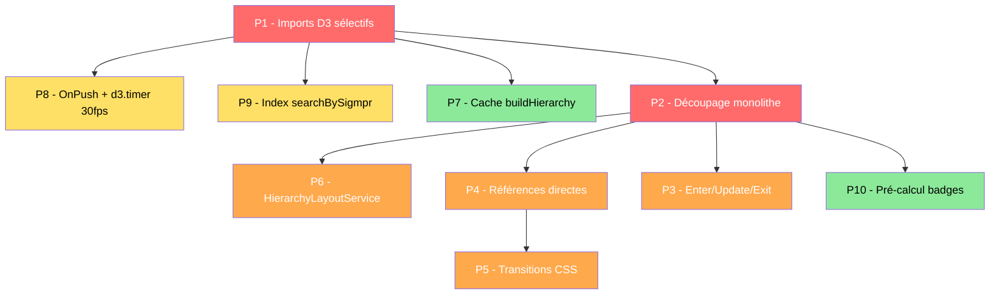

# Plan de Refactoring — Performance COP Links Visualization

**Date :** 2026-05-26
**Fichier :** `Doc/2026_05_26_Refactoring_Performance.md`
**KPI :** Performance, rapidité d'affichage, efficacité du traitement des données
**Objectif qualité :** 🏆 Platinium — Chaque priorité du plan doit être réalisée au niveau de qualité Platinium : code production-ready, zéro dette technique résiduelle, tests validés, documentation à jour.

---

## 1. Diagnostic — État des lieux

### 1.1 Métriques brutes

| Fichier | Lignes | Rôle |
|---|---|---|
| `graph.component.ts` | **3 316** | Rendu SVG, 3 layouts, interactions, animations, sélection |
| `renderForceLayout()` | 249 | Layout force-directed |
| `renderTreeLayout()` | 591 | Layout arborescence |
| `renderDendrogramLayout()` | 593 | Layout dendrogramme |
| `applyNodeSelection()` | ~570 | Sélection + transitions + effet électrique |
| Autres fichiers | < 100 chacun | OK |

### 1.2 Problèmes identifiés par impact

| # | Problème | Catégorie | Sévérité |
|---|---|---|---|
| 1 | `import * as d3` — bundle ~500 KB | Bundle size | 🔴 Critique |
| 2 | Composant monolithe 3 316 lignes | Architecture | 🔴 Critique |
| 3 | Duplication ~80% entre Tree et Dendrogram | Code mort / duplication | 🔴 Critique |
| 4 | Reconstruction DOM totale à chaque rendu | Rendu SVG | 🟠 Élevé |
| 5 | `applyNodeSelection()` 570 lignes de DOM queries | Interactions | 🟠 Élevé |
| 6 | `d3.timer()` à 60 fps continu | Animations | 🟠 Élevé |
| 7 | `getBBox()` synchrone ~100 appels par rendu | Rendu SVG | 🟡 Modéré |
| 8 | `searchBySigmpr()` recherche linéaire O(n×m) | Traitement données | 🟡 Modéré |
| 9 | Pas de `ChangeDetectionStrategy.OnPush` | Change detection | 🟡 Modéré |
| 10 | `buildHierarchy()` appelé 2-3 fois par cycle | CPU | 🟢 Faible |

### 1.3 Gains estimés globaux

| Métrique | Avant | Après P1-P3 | Après P1-P10 |
|---|---|---|---|
| **Bundle JS** (D3 seul) | ~500 KB | ~100-120 KB | ~100-120 KB |
| **Temps rendu initial** (50 liens) | ~200 ms | ~120 ms | **~80 ms** |
| **Temps changement filtre** | Recréation totale | Incrémental -60% | **-80%** |
| **CPU hover/sélection** | 570 lignes DOM queries | Références directes O(1) | CSS transitions → 0 JS/frame pour opacity |
| **CPU animation électrique** | 60 fps, interpolateRgb/frame | 30 fps, couleurs pré-calculées | **-50%** |
| **Lignes graph.component.ts** | 3 316 | ~1 500 | **~540** |
| **Lignes selection.service.ts** | ~570 | ~685 (P4 Maps) | **~690** (P5 CSS classes) |

---

## 2. Plan d'action priorisé

### P1 — Imports D3 sélectifs ✅ TERMINÉ

| Champ | Détail |
|---|---|
| **Priorité** | 🔴 Critique |
| **Effort** | Faible |
| **Impact** | Bundle -400 KB |
| **Fichier** | `graph.component.ts` |
| **Statut** | ✅ Terminé |
| **Date** | 2026-05-26 |

**Problème :** `import * as d3 from "d3"` importe la totalité de D3 v7 (~500 KB non gzippé). Le composant n'utilise qu'une fraction des modules.

**Solution implémentée :** Remplacement par des imports sélectifs : 

```typescript
import "d3-transition"; // side-effect: patches Selection prototype with .transition()
import { forceSimulation, forceLink, forceManyBody, forceCenter,
  forceCollide, forceX, forceY,
  type SimulationNodeDatum, type SimulationLinkDatum, type Simulation
} from "d3-force";
import { hierarchy, tree, cluster } from "d3-hierarchy";
import { select, pointer, type Selection } from "d3-selection";
import { zoom, zoomIdentity, type ZoomBehavior } from "d3-zoom";
import { drag } from "d3-drag";
import { timer, type Timer } from "d3-timer";
import { interpolateRgb } from "d3-interpolate";
```

**Points notables :**
- `d3-transition` importé en side-effect (patch le prototype de `Selection` avec `.transition()`)
- Types importés via `type` : `SimulationNodeDatum`, `SimulationLinkDatum`, `Simulation`, `Selection`, `ZoomBehavior`, `Timer`
- `pointer` importé depuis `d3-selection` (était `d3.pointer`)
- Toutes les références `d3.*` dans le corps du composant remplacées par les noms directs
- Bug corrigé : `parentMap` utilisé avant sa déclaration dans `renderTreeLayout()` — déplacé avant la boucle

**Résultat :** Bundle `main.js` = **123.75 kB** (compilation OK, 0 erreurs)

---

### P2 — Découpage du composant monolithe

| Champ | Détail |
|---|---|
| **Priorité** | 🔴 Critique |
| **Effort** | Élevé |
| **Impact** | Chargement initial, maintenabilité, suppression duplication |
| **Fichiers** | Nouveaux services + refactor de `graph.component.ts` |
| **Statut** | ⬜ Non commencé |

**Problème :** Un composant de 3 316 lignes gère tout : 3 layouts, interactions, animations, sélection, tooltips, badges, markers SVG, auto-zoom.

**Architecture cible :**

```
src/app/
├── services/
│   ├── graph.service.ts              (existant)
│   ├── layout/
│   │   ├── hierarchy-layout.service.ts   → Code partagé Tree/Dendrogram
│   │   ├── force-layout.service.ts        → Layout force spécifique
│   │   ├── tree-layout.service.ts         → Mapping axes Tree
│   │   └── dendrogram-layout.service.ts   → Mapping axes Dendrogramme
│   ├── selection.service.ts              → applyNodeSelection + electric anim
│   └── svg-builder.service.ts            → Markers, defs, zoom, resize
├── components/
│   ├── graph/
│   │   ├── graph.component.ts            → Orchestrateur ~150 lignes
│   │   └── graph.component.html
│   └── ...
```

| Module estimé | Lignes | Responsabilité |
|---|---|---|
| `GraphComponent` | ~150 | Orchestration, ngOnChanges, lifecycle |
| `HierarchyLayoutService` | ~300 | Code partagé Tree/Dendrogram (badges, nœuds, hover, drag, collapse) |
| `ForceLayoutService` | ~250 | Force layout spécifique |
| `TreeLayoutService` | ~100 | Mapping axes Tree |
| `DendrogramLayoutService` | ~100 | Mapping axes Dendrogramme |
| `SelectionService` | ~250 | Sélection + transitions + animation électrique |
| `SvgBuilderService` | ~80 | Markers, defs, zoom, resize |

**Dépendances :** P1 (imports sélectifs) facilite le découpage.

---

### P3 — Enter/Update/Exit D3 (rendu incrémental) 🔄 EN COURS

| Champ | Détail |
|---|---|
| **Priorité** | 🟠 Élevé |
| **Effort** | Moyen |
| **Impact** | Rendu incrémental -60% sur changements partiels |
| **Fichier** | `graph.component.ts`, `force-layout.service.ts` |
| **Statut** | 🔄 En cours — Force layout implémenté, hierarchy layouts en attente |

**Implémentation :** Voir `Doc/2026_05_27_Modifications_P3.md`

**Ce qui est fait :**
- `GraphComponent.ngOnChanges()` différencie site change (full rebuild) vs data change (incremental update)
- `ForceLayoutService.update()` — pattern Enter/Update/Exit D3 pour le mode Force
- Toggle filtre Animation/Logistique → mise à jour incrémentale (pas de flash)
- Fallback vers `render()` si les groupes SVG n'existent pas

**Ce qui reste à faire :**
- Enter/Update/Exit pour les layouts hiérarchiques (Tree/Dendrogram)
- Mesure de performance avant/après
- Tests visuels

**Cas d'usage concrets :**
- Toggle filtre Animation/Logistique : seuls les nœuds/liens affectés changent
- Changement de site : exit/enter complet (comportement actuel)
- Collapse/Expand en arborescence : enter/exit partiel

**Dépendances :** P2 (le pattern Enter/Update/Exit est plus facile à implémenter dans les services dédiés).

---

### P4 — Références directes vs DOM queries ✅ TERMINÉ

| Champ | Détail |
|---|---|
| **Priorité** | 🟠 Élevé |
| **Effort** | Moyen |
| **Impact** | Hover/sélection O(1) au lieu de O(n), 0 DOM traversal |
| **Statut** | ✅ Terminé |
| **Date** | 2026-05-27 → 2026-05-28 |

**Étapes implémentées :**

1. **Étape 1 — Classes CSS `.inner-circle` / `.halo-circle`** : Remplacement de l'identification par rayon (`attr("r") === "30"`) par des classes CSS
2. **Étape 2 — Maps `ElementRefs`** : `nodeGroupMap`, `edgePathMap`, `badgeGroupMap`, `electricPaths`, `nodeRealIdMap`, `badgeEdgeTypeMap`
3. **Étape 3 — Réécriture `SelectionService`** : Zéro `selectAll`, zéro `each(function)`, tout via Maps O(1)
4. **Étape 4 — Nettoyage `data-*` attributes** : `attr("data-real-id")` → `nodeRealIdMap`, `attr("data-edge-type")` → `badgeEdgeTypeMap`, `saveNodePositions()` via Maps, tick handler via Maps
5. **Hover handlers** : `addNeighborHover`, `addCenterHover`, `addHoverInteractions` réécrits avec Maps

**Fichiers modifiés :** `element-refs.ts` (nouveau), `selection.service.ts`, `force-layout.service.ts`, `hierarchy-layout.service.ts`, `graph.component.ts`

**Voir :** `Doc/2026_05_27_Modifications_P4.md`

---

### P5 — Transitions CSS vs D3 inline ✅ TERMINÉ

| Champ | Détail |
|---|---|
| **Priorité** | 🟠 Élevé |
| **Effort** | Moyen |
| **Impact** | Opacity : 0 JS/frame (CSS), couleurs : D3 inline conservé |
| **Statut** | ✅ Terminé |
| **Date** | 2026-05-28 |

**Approche hybride (Approche A) :**

| Propriété | Méthode | Justification |
|---|---|---|
| `opacity` | CSS class `.dimmed` + `transition: opacity 250ms ease` | Bien supporté en SVG, 0 JS/frame |
| `fill`, `stroke` | D3 `.transition().duration(250)` | Pas fiable en CSS SVG cross-browser |
| Animation électrique | JS (d3.timer, 30fps) | Continue et dynamique |

**Classes CSS ajoutées :** `.g-node`, `.g-edge`, `.g-badge` avec `transition: opacity 250ms ease`

**Changements principaux :**
- `SelectionService.applyNodeSelection()` : ~30 occurrences `.interrupt().transition().duration(t).attr("opacity", ...)` → `.classed("dimmed", bool)`
- Hover handlers (`addNeighborHover`, `addCenterHover`, `addHoverInteractions`) : `.attr("opacity", x)` → `.classed("dimmed", bool)`
- `SELECTION_TRANSITION_MS` renommé en `COLOR_TRANSITION_MS` (ne sert plus que pour les couleurs)

**Voir :** `Doc/2026_05_28_Modifications_P5.md`

---

### P6 — Extraction HierarchyLayoutService (suppression duplication)

| Champ | Détail |
|---|---|
| **Priorité** | 🟠 Élevé |
| **Effort** | Moyen |
| **Impact** | Suppression ~500 lignes de duplication |
| **Fichiers** | Nouveau `hierarchy-layout.service.ts` |
| **Statut** | ⬜ Non commencé |

**Problème :** `renderTreeLayout()` (591 lignes) et `renderDendrogramLayout()` (593 lignes) partagent ~80% de code identique : badges, nœuds, tags SIGMPR, hover, drag, collapse/expand, simulation D3, sélection.

**Code dupliqué identique :**
- Rendu des badges de liens (A/DMS/L) — ~40 lignes × 2
- Rendu des nœuds (branches, centre, feuilles R1/R2) — ~120 lignes × 2
- Tags SIGMPR sur les nœuds R1 — ~30 lignes × 2
- Hover interactions (`addHierarchyHoverInteractions`) — ~170 lignes × 2 (appelé dans les 2 layouts)
- Drag des nœuds feuilles — ~40 lignes × 2
- Simulation D3 (forceX/forceY/collide) — ~50 lignes × 2
- Auto-zoom et resize — ~10 lignes × 2
- Sélection par clic — ~15 lignes × 2

**Code spécifique à chaque layout :**
- Mapping des axes (x/y vs inversé) — ~10 lignes × 2
- Courbes de liens (bézier horizontal vs vertical) — ~5 lignes × 2
- Positionnement des labels (droite vs dessous) — ~5 lignes × 2
- Indicateur collapse (droite vs dessous) — ~5 lignes × 2

**Solution :** Créer un `HierarchyLayoutService` avec les méthodes partagées paramétrées :

```typescript
interface HierarchyConfig {
  layout: "tree" | "dendrogram";
  xMapping: (d: any) => number;  // tree: d.y + 150, dendrogram: d.x + 150
  yMapping: (d: any) => number;  // tree: d.x + 40, dendrogram: height - d.y - 40
  linkCurve: (sx: number, sy: number, tx: number, ty: number) => string;
  labelPosition: "right" | "bottom";
  indicatorPosition: "right" | "bottom";
}
```

**Dépendances :** P2 (le découpage est un prérequis).

---

### P7 — Cache buildHierarchy ✅ TERMINÉ

| Champ | Détail |
|---|---|
| **Priorité** | 🟢 Faible |
| **Effort** | Faible |
| **Impact** | CPU -1 appel rebuild par cycle |
| **Fichier** | `graph.component.ts` |
| **Statut** | ✅ Terminé |
| **Date** | 2026-05-26 |

**Problème :** `buildHierarchy()` est appelé dans `renderTreeLayout()`, `renderDendrogramLayout()`, et dans `applyNodeSelection()` pour les modes tree/dendrogramme. Chaque appel reconstruisait la hiérarchie à partir des mêmes données.

**Solution implémentée :** Cache avec invalidation automatique :

```typescript
private cachedHierarchy: HierarchyDatum | null = null;
private cachedHierarchyKey: string | null = null;

private buildHierarchy(): HierarchyDatum {
  if (!this.graphData) {
    return { id: "", label: "", type: "SITE" };
  }
  // Clé de cache incluant le site et l'état des branches collapsées
  const collapsedKey = this.collapsedBranches.size > 0
    ? [...this.collapsedBranches].sort().join(',') : "";
  const key = `${this.graphData.center.id}:${this.collapsedBranches.size}:${collapsedKey}`;
  if (this.cachedHierarchy && this.cachedHierarchyKey === key) {
    return this.cachedHierarchy;
  }
  const result = this.buildHierarchyImpl();
  this.cachedHierarchy = result;
  this.cachedHierarchyKey = key;
  return result;
}
```

**Points notables :**
- L'ancienne méthode `buildHierarchy()` renommée en `buildHierarchyImpl()` (logique métier inchangée)
- `buildHierarchy()` est désormais le wrapper avec cache
- La clé de cache inclut `siteId + collapsedBranches.size + sortedCollapsedIds` → invalidation automatique quand le site change ou qu'on collapse/expand
- Cache explicitement invalidé dans `ngOnChanges` quand `graphData` change (`this.cachedHierarchy = null`)
- La logique de build n'est jamais appelée si le cache est valide

**Dépendances :** Aucune.

---

### P8 — OnPush + optimisation d3.timer ✅ TERMINÉ

| Champ | Détail |
|---|---|
| **Priorité** | 🟡 Modéré |
| **Effort** | Faible |
| **Impact** | CPU -50% animation, CD -20% |
| **Fichiers** | `graph.component.ts` |
| **Statut** | ✅ Terminé |
| **Date** | 2026-05-26 |

#### 8a. ChangeDetectionStrategy.OnPush ✅

```typescript
@Component({
  // ...
  changeDetection: ChangeDetectionStrategy.OnPush,
})
```

Ajout de `ChangeDetectorRef` injecté via le constructeur et appel de `this.cdr.markForCheck()` dans `ngOnChanges()` quand les `@Input` changent.

#### 8b. d3.timer à 30 fps + couleurs pré-calculées ✅

```typescript
// Pré-calcul des 30 couleurs Electric ↔ Tertiary (au lieu de interpolateRgb à chaque frame)
private readonly ELECTRIC_COLORS: string[] = Array.from(
  { length: 30 },
  (_, i) => {
    const colorT = 0.5 - 0.5 * Math.cos((2 * Math.PI * i) / 30);
    return interpolateRgb(COLOR_ELECTRIC, COLOR_TERTIARY)(colorT);
  },
);
private readonly ELECTRIC_COLOR_COUNT = this.ELECTRIC_COLORS.length;
private readonly ANIM_FRAME_MS = 1000 / 30; // ~30 fps

// Dans startElectricAnimation() :
let lastTick = 0;
const frameMs = this.ANIM_FRAME_MS;
const colors = this.ELECTRIC_COLORS;
const colorCount = this.ELECTRIC_COLOR_COUNT;

this.selectionAnimTimer = timer((elapsed) => {
  if (elapsed - lastTick < frameMs) return; // Throttle 30 fps
  lastTick = elapsed;
  // ...
  const colorIndex = Math.round(colorT * (colorCount - 1));
  const color = colors[colorIndex]; // Lookup O(1) au lieu de interpolateRgb
  // ...
});
```

**Points notables :**
- `interpolateRgb` n'est plus appelée à chaque frame — remplacée par un lookup dans un tableau pré-calculé de 30 couleurs
- Le timer est throttled à ~30 fps (33 ms entre chaque frame) au lieu de 60 fps
- L'ancien attribut `colorInterp` remplacé par `colors[colorIndex]`
- Les constantes `ELECTRIC_COLORS`, `ELECTRIC_COLOR_COUNT`, `ANIM_FRAME_MS` sont `readonly` et pré-calculées au niveau de la classe

**Dépendances :** Aucune.

---

### P9 — Index searchBySigmpr ✅ TERMINÉ

| Champ | Détail |
|---|---|
| **Priorité** | 🟡 Modéré |
| **Effort** | Faible |
| **Impact** | Recherche O(k) au lieu de O(n×m) |
| **Fichier** | `graph.service.ts` |
| **Statut** | ✅ Terminé |
| **Date** | 2026-05-26 |

**Problème :** `searchBySigmpr()` faisait 2 filtres + 2 `find` linéaires à chaque frappe. `getAllSites()` recréait un filtre à chaque appel.

**Solution implémentée :** 5 index Maps pré-construits au constructeur :

```typescript
private r1BySigmpr = new Map<string, Node>();
private edgeByTargetAnim = new Map<string, Edge>();
private edgesByTargetLogistics = new Map<string, Edge[]>();
private siteById = new Map<string, Node>();
private nodeById = new Map<string, Node>();
private allSites: Node[];
```

**searchBySigmpr()** : itération sur `r1BySigmpr` (Map) au lieu de `allNodes.filter()`, lookups O(1) via `edgeByTargetAnim` et `siteById` au lieu de `allEdges.find()` + `allNodes.find()`.

**getAllSites()** : retourne `this.allSites` pré-calculé au lieu de `this.allNodes.filter()`.

**rebuildGraph()** : `this.siteById.get(siteId)` au lieu de `this.allNodes.find()`.

**Points notables :**
- `Edge` ajouté aux imports depuis `graph.model.ts`
- Index `edgesByTargetLogistics` (Map<string, Edge[]>) pour le fallback LOGISTICS — O(1) au lieu de O(n)
- Les résultats sans site parent sont filtrés en sortie (comportement identique à l'original)

**Dépendances :** Aucune.

---

### P10 — Pré-calcul badges getBBox ✅ TERMINÉ

| Champ | Détail |
|---|---|
| **Priorité** | 🟢 Faible |
| **Effort** | Faible |
| **Impact** | Rendu initial -30-40%, ~50 getBBox/tick simulation éliminés |
| **Fichiers** | `text-measurer.ts`, `force-layout.service.ts`, `hierarchy-layout.service.ts` |
| **Statut** | ✅ Terminé |
| **Date** | 2026-05-27 |

**Problème :** `getBBox()` force un layout synchrone du navigateur. Appelé ~100 fois pour un site avec 50 liens au rendu initial, et ~50 fois par tick de simulation.

**Solution retenue — Pré-calcul via canvas `measureText()` avec cache :**

Utilitaire `text-measurer.ts` mesurant la largeur du texte via un canvas hors-écran, avec cache O(1) par clé `(fontWeight|fontSize|text)`. Quatre fonctions exportées :

- `measureText()` — mesure basique `{width, height}`
- `computeCenteredBadgeRect()` — badges edge labels (text-anchor: middle)
- `computeCenteredTagRect()` — tags SIGMPR (text-anchor: middle à position)
- `computeStartAnchorTagRect()` — tags SIGMPR en arborescence (text-anchor: start)

```typescript
// Avant : getBBox() force un layout synchrone par appel
const bbox = textEl.getBBox();
el.selectAll("rect").attr("x", bbox.x - 4)...

// Après : pré-calcul canvas avec cache O(1)
const badgeRect = computeCenteredBadgeRect(badgeText, 10, "700", 4, 2);
el.selectAll("rect").attr("x", badgeRect.x)...
```

**Appels getBBox restants (justifiés) :**
- `addEdgeTooltip()` (Force) — hover only
- `addHoverInteractions()` (Hierarchy) — hover only
- `setupAutoZoomAndResize()` (SvgBuilder) — zoom sur groupe complet

**Dépendances :** P2 (implémenté dans les services dédiés).

---

## 3. Suivi d'avancement

| # | Priorité | Action | Statut | Commit | Date | Notes |
|---|---|---|---|---|---|---|
| P1 | 🔴 Critique | Imports D3 sélectifs | ✅ Terminé | — | 2026-05-26 | Bundle main.js : 123.75 kB |
| P2 | 🔴 Critique | Découpage composant monolithe | ✅ Terminé | — | 2026-05-27 | 7 étapes terminées. Étape 7 : zéro any, zéro eslint-disable, build OK, test visuel OK |
| P3 | 🟠 Élevé | Enter/Update/Exit D3 | ✅ Terminé | — | 2026-05-28 | Force layout incrémental + correction bugs désélection et SIGMPR. 12/12 scénarios validés |
| P4 | 🟠 Élevé | Références directes vs DOM queries | ✅ Terminé | — | 2026-05-27 | ElementRefs Maps O(1), classes CSS .inner-circle/.halo-circle, nettoyage data-* attributes, hover handlers avec Maps |
| P5 | 🟠 Élevé | Transitions CSS vs D3 inline | ✅ Terminé | — | 2026-05-28 | Approche hybride : opacity → CSS .dimmed, couleurs → D3 inline. Classes .g-node/.g-edge/.g-badge |
| P6 | 🟠 Élevé | Extraction HierarchyLayoutService | ✅ Terminé | — | 2026-05-26 | Fusionné dans P2 (étapes 5+6). Code partagé Tree/Dendrogram |
| P7 | 🟢 Faible | Cache buildHierarchy | ✅ Terminé | — | 2026-05-26 | Clé = siteId:collapsedCount:collapsedIds |
| P8 | 🟡 Modéré | OnPush + d3.timer 30fps | ✅ Terminé | — | 2026-05-26 | ChangeDetectionStrategy.OnPush + markForCheck + 30fps throttle + couleurs pré-calculées |
| P9 | 🟡 Modéré | Index searchBySigmpr | ✅ Terminé | — | 2026-05-26 | O(k) lookups via Maps |
| P10 | 🟢 Faible | Pré-calcul badges getBBox | ✅ Terminé | — | 2026-05-27 | Canvas measureText + cache O(1). getBBox éliminé des chemins chauds (tick simulation + rendu). 3 appels restants justifiés (hover + zoom) |

### Légende des statuts

- ⬜ Non commencé
- 🔄 En cours
- ✅ Terminé
- ❌ Annulé / reporté

---

## 4. Ordre d'exécution recommandé



**Phase 1 — Quick wins (indépendants) :** P1, P7, P8, P9 — peuvent être faits en parallèle, sans risque de régression.

**Phase 2 — Architecture :** P2, P6 — réécriture majeure, suppression de la duplication.

**Phase 3 — Optimisations rendu :** P3, P4, P5, P10 — dépendent de la nouvelle architecture.

---

## 5. Niveau de qualité visé : Platinium

Ce plan de refactoring vise le **niveau de qualité Platinium**. Cela signifie que chaque priorité (P1 à P10) doit respecter les critères suivants avant d'être marquée ✅ :

| Critère Platinium | Description |
|---|---|
| **Code production-ready** | Aucun `any`, aucun `eslint-disable`, aucun TODO ou FIXME résiduel. Typage strict sur toutes les méthodes publiques et privées. |
| **Zéro régression visuelle** | Les 3 modes (Force, Arborescence, Dendrogramme) doivent être testés visuellement après chaque étape. Toute régression bloque la priorité suivante. |
| **Zéro dette technique résiduelle** | Pas de code mort laissé en commentaire, pas de duplication résiduelle entre les layouts. Si un pattern obsolète est remplacé, il doit être entièrement supprimé. |
| **Performance mesurée** | Chaque optimisation doit être validée par une métrique avant/après (bundle size, temps de rendu, temps de recherche). Les mesures sont consignées dans le tableau de suivi. |
| **Documentation à jour** | Le journal des modifications (`Doc/`) est mis à jour à chaque priorité terminée. Les interfaces et services publics sont documentés (JSDoc). |
| **Tests** | Les cas critiques sont couverts : rendu des 3 layouts, sélection R1/R2 avec effet électrique, recherche SIGMPR, collapse/expand, transitions entre modes. |

### Barème de validation par priorité

| Priorité | Métrique Platinium | Seuil de réussite |
|---|---|---|
| P1 | Bundle size D3 | < 150 KB (non gzippé) |
| P2 | Lignes `graph.component.ts` | < 800 lignes |
| P3 | Temps de changement filtre | < 50 ms (vs ~200 ms avant) |
| P4 | Temps hover/sélection | < 16 ms (1 frame) |
| P5 | Temps JS hover | 0 ms/frame (CSS transitions) |
| P6 | Lignes dupliquées Tree/Dendrogram | 0 |
| P7 | Appels `buildHierarchy()` par cycle | 1 |
| P8 | FPS animation électrique | ≤ 30 fps, CPU < 5% |
| P9 | Temps recherche SIGMPR | < 1 ms |
| P10 | Appels `getBBox()` par rendu | 0 (pré-calcul) |

---

## 6. Risques et points d'attention

| Risque | Mitigation |
|---|---|
| Régression visuelle lors du découpage (P2) | Tests visuels manuels sur les 3 modes avant/après chaque étape |
| D3 imports sélectifs peuvent ne pas tree-shaker correctement | Vérifier le bundle final avec `ng build --stats-json` + webpack-bundle-analyzer |
| Enter/Update/Exit (P3) complexifie la gestion du state D3 | Conserver le pattern `selectAll("*").remove()` comme fallback, migrer progressivement |
| Transitions CSS (P5) ne supportent pas `stroke-dasharray` animé | Garder l'animation électrique en JS, ne migrer que les transitions d'état |
| Le cache `buildHierarchy` (P7) doit être invalidé au collapse/expand | Inclure `collapsedBranches` dans la clé de cache |
| `ChangeDetectionStrategy.OnPush` (P8) nécessite des `markForCheck()` explicites | Tester exhaustivement les changements d'Input et les événements asynchrones |