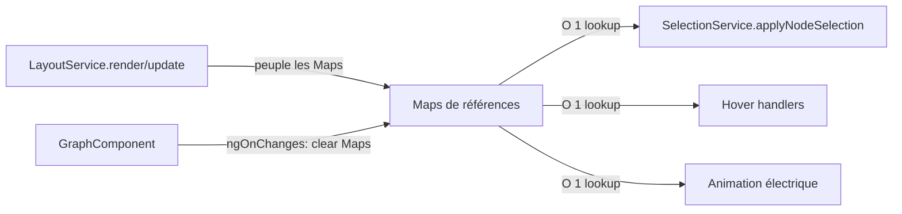

# Brief — P4 : Références directes vs DOM queries

**Date :** 2026-05-28
**Objectif :** Remplacer les sélecteurs DOM coûteux dans `SelectionService.applyNodeSelection()` par des Maps de références directes (O(1) au lieu de O(n))

---

## 1. État actuel du projet

### Architecture post-P3

```
src/app/
├── services/
│   ├── graph.service.ts              (données mock + filtrage + searchBySigmpr)
│   ├── mock-graph-data.ts             (données mock)
│   ├── layout/
│   │   ├── force-layout.service.ts    (layout Force — render() + update())
│   │   ├── hierarchy-layout.service.ts (code partagé Tree/Dendrogram)
│   │   ├── tree-layout.service.ts      (config Tree)
│   │   └── dendrogram-layout.service.ts (config Dendrogram)
│   ├── selection.service.ts           (sélection + transitions + animation électrique)
│   └── svg-builder.service.ts         (markers, defs, zoom, resize)
├── components/
│   ├── graph/
│   │   ├── graph.component.ts          (orchestrateur ~463 lignes)
│   │   └── graph.component.html
│   ├── legend/
│   ├── site-selector/
│   ├── layout-selector/
│   └── sigmpr-search/
├── models/
│   ├── graph.model.ts
│   ├── hierarchy-config.ts
│   └── colors.ts
└── app.component.ts/html
```

### P1-P3 terminés ✅
- P1 : Imports D3 sélectifs
- P2 : Découpage du composant monolithe (4 services extraits)
- P3 : Enter/Update/Exit D3 (mode Force incrémental) + correction bugs désélection et SIGMPR

---

## 2. Problème

`SelectionService.applyNodeSelection()` (~570 lignes) est la méthode la plus coûteuse du projet. Chaque sélection/désélection de nœud ou hover déclenche des traversées DOM massives :

```typescript
// Requêtes DOM répétées à chaque sélection (O(n) chacune)
const allNodes = g.selectAll("[data-node-id]");                    // traverse tous les éléments SVG
g.selectAll(".edges path, .tree-links path").each(function() { }) // traverse tous les chemins
g.selectAll(".link-badges g, .edge-labels g").each(function() { }) // traverse tous les badges
const r = d3.select(this).attr("r");                               // identification par rayon de cercle !
```

### Impact performance

| Action | Traversées DOM | Éléments scannés (estimé) |
|---|---|---|
| Sélection d'un nœud | ~10 `selectAll` + `each` | ~200+ éléments SVG |
| Désélection | ~8 `selectAll` + `each` | ~200+ éléments SVG |
| Hover → mouseleave | 1-2 `selectAll` | ~200+ éléments SVG |
| Animation électrique (30fps) | 1 `selectAll` + `filter` par tick | ~200+ éléments SVG |

### Anti-patterns identifiés

1. **`selectAll("[data-node-id]")`** — Traversée complète du DOM pour trouver les nœuds, alors qu'on connaît leurs IDs
2. **`selectAll(".edges path")`** — Traversée pour trouver les arêtes, alors qu'on connaît leurs clés (`sourceId|targetId|edgeType`)
3. **Identification par rayon de cercle** — `select(this).attr("r") === "30"` pour distinguer le cercle intérieur du halo, au lieu d'une classe CSS ou d'une référence directe
4. **Recherche de `data-*` attributes** — `el.attr("data-edge-type")` pour retrouver le type d'arête, au lieu d'un lookup dans une Map

---

## 3. Solution proposée

### Principe

Maintenir des Maps de références D3 (`Selection`) peuplées lors du rendu (`render()` / `update()`) et utilisées lors de la sélection/hover :

```typescript
// Maps de références (O(1) lookup)
private nodeGroupMap = new Map<string, Selection<SVGGElement, unknown, null, undefined>>();
private edgePathMap = new Map<string, Selection<SVGPathElement, unknown, null, undefined>>();
private badgeGroupMap = new Map<string, Selection<SVGGElement, unknown, null, undefined>>();
```

### Flux de données



### Avant vs Après

| Opération | Avant (DOM query) | Après (Map lookup) |
|---|---|---|
| Trouver un nœud par ID | `g.selectAll("[data-node-id]").each(...)` + `attr("data-node-id")` | `nodeGroupMap.get(id)` |
| Trouver une arête par clé | `g.selectAll(".edges path").each(...)` + `attr("data-source-id")` + `attr("data-target-id")` | `edgePathMap.get(key)` |
| Trouver un badge par clé | `g.selectAll(".link-badges g").each(...)` + `attr("data-target-id")` | `badgeGroupMap.get(key)` |
| Identifier cercle intérieur vs halo | `select(this).attr("r") === "30" \|\| === "22"` | Classe CSS `.inner-circle` / `.halo-circle` ou sous-sélection nommée |
| Trouver le type d'arête | `el.attr("data-edge-type")` | Donnée stockée dans la Map (ou datum D3) |

---

## 4. Implémentation — Étapes proposées

### Étape 1 — Ajouter des classes CSS sur les cercles

Remplacer l'identification par rayon (`attr("r") === "30" || === "22"`) par des classes CSS :

```typescript
// Dans drawNodeCircles() (ForceLayoutService) et drawNodes() (HierarchyLayoutService)
innerCircle.attr("class", "inner-circle");
haloCircle.attr("class", "halo-circle");

// Dans applyNodeSelection() — AVANT
const innerCircle = circles.filter(function() {
  const r = select(this).attr("r");
  return r === "30" || r === "22";
});

// Après
const innerCircle = nodeGroup.select("circle.inner-circle");
const haloCircle = nodeGroup.select("circle.halo-circle");
```

**Fichiers :** `force-layout.service.ts`, `hierarchy-layout.service.ts`, `selection.service.ts`

### Étape 2 — Créer les Maps dans les services de layout

Les Maps sont peuplées pendant le rendu et retournées au composant :

```typescript
// ForceRenderContext — ajouter les Maps
interface ForceRenderContext {
  // ... existant
  nodeGroupMap?: Map<string, Selection<SVGGElement, SimNode, SVGGElement, unknown>>;
  edgePathMap?: Map<string, Selection<SVGPathElement, SimLink, SVGGElement, unknown>>;
  badgeGroupMap?: Map<string, Selection<SVGGElement, SimLink, SVGGElement, unknown>>;
}
```

Ou mieux : les Maps sont gérées par le composant et passées aux services pour population :

```typescript
// Dans GraphComponent
private nodeGroupMap = new Map<...>();
private edgePathMap = new Map<...>();
private badgeGroupMap = new Map<...>();

// Passage aux services de layout
this.forceLayout.render({ ..., nodeGroupMap: this.nodeGroupMap, ... });
```

Les services de layout peuplent les Maps pendant le rendu (après `enter` + `merge`).

**Fichiers :** `graph.component.ts`, `force-layout.service.ts`, `hierarchy-layout.service.ts`

### Étape 3 — Réécrire `applyNodeSelection()` avec les Maps

```typescript
// AVANT — 570 lignes avec des each() et des selectAll
applyNodeSelection(ctx: SelectionContext): void {
  const allNodes = g.selectAll("[data-node-id]");
  allNodes.interrupt().transition().duration(t).attr("opacity", function() {
    const nodeId = select(this).attr("data-node-id");
    return nodeId && connectedNodeIds.has(nodeId) ? 1 : 0.25;
  });
  g.selectAll(".edges path").each(function() {
    const el = select(this);
    const sourceId = el.attr("data-source-id");
    const targetId = el.attr("data-target-id");
    // ...
  });
}

// APRÈS — lookup O(1) par Map
applyNodeSelection(ctx: SelectionContext): void {
  // Noeuds : itérer sur les IDs connus
  for (const [nodeId, nodeGroup] of nodeGroupMap) {
    const connected = connectedNodeIds.has(nodeId);
    nodeGroup.interrupt().transition().duration(t).attr("opacity", connected ? 1 : 0.25);
    // Couleurs du cercle intérieur
    const inner = nodeGroup.select("circle.inner-circle");
    // ...
  }

  // Arêtes : itérer sur les clés connues
  for (const [key, pathEl] of edgePathMap) {
    const [sourceId, targetId, edgeType] = key.split("|");
    const connected = isConnected(sourceId, targetId);
    // ...
  }
}
```

**Fichiers :** `selection.service.ts`

### Étape 4 — Nettoyer les `data-*` attributes devenus inutiles

Les attributs `data-source-id`, `data-target-id`, `data-edge-type` sur les arêtes et badges peuvent être conservés (utiles pour le debug visuel et le tooltip), mais ne seront plus lus dans `applyNodeSelection()`.

Les attributs `data-node-id` et `data-real-id` restent nécessaires pour `saveNodePositions()`.

---

## 5. Fichiers clés à lire

| Fichier | Lignes | Rôle |
|---|---|---|
| `src/app/services/selection.service.ts` | 1-700 | `applyNodeSelection()` — cible principale de P4 |
| `src/app/services/layout/force-layout.service.ts` | 66-320 | `render()` — peuple les éléments SVG (Maps à ajouter ici) |
| `src/app/services/layout/force-layout.service.ts` | 327-756 | `update()` — Enter/Update/Exit (Maps à mettre à jour ici) |
| `src/app/services/layout/hierarchy-layout.service.ts` | 85-400 | `render()` — peuple les éléments SVG (Maps à ajouter ici) |
| `src/app/components/graph/graph.component.ts` | 87-101 | `getSelectionContext()` — passe le contexte au SelectionService |
| `Doc/2026_05_26_Refactoring_Performance.md` | 171-214 | Description P4 originale |

---

## 6. Risques et points d'attention

| Risque | Mitigation |
|---|---|
| **Maps désynchronisées du DOM** — Après `incrementalUpdate()`, les Maps doivent refléter les éléments ajoutés/supprimés | Vider et repeupler les Maps dans `update()` (Enter/Update/Exit) |
| **Maps périmées après `fullRebuild()`** — Le SVG est détruit et recréé | Vider les Maps au début de `fullRebuild()` et les repeupler dans `render()` |
| **Maps périmées après changement de layout** — Les IDs composites (Tree/Dendrogram) diffèrent du mode Force | Vider les Maps dans `renderGraph()` et les repeupler dans chaque `render*Layout()` |
| **`saveNodePositions()` utilise `data-node-id`** — Cette méthode lit les positions depuis le DOM | Conserver `data-node-id` sur les nœuds (pas supprimé par P4) |
| **Hover handlers dans les layouts utilisent aussi des sélecteurs DOM** | Mettre à jour les hover handlers pour utiliser les Maps aussi |
| **Animation électrique utilise `selectAll(".edges path, .tree-links path").filter(".electric-current")`** | Utiliser une Map `electricPathMap` ou une liste de références |

---

## 7. Critères de validation — Platinium

| Critère | Description |
|---|---|
| Code production-ready | Zéro `any`, typage strict sur les Maps |
| Zéro régression visuelle | Les 3 modes testés : sélection, désélection, hover, SIGMPR, animation électrique |
| Performance mesurable | `applyNodeSelection()` ne contient plus aucun `selectAll` ni `each(function)` de traversée DOM |
| Maps cohérentes | Vérifier que les Maps sont vides et repeuplées à chaque `render()` / `update()` / `fullRebuild()` |
| Documentation à jour | Journal des modifications dans `Doc/` |

---

## 8. Dépendance avec P5

P5 (Transitions CSS) dépend de P4 car les références directes facilitent le toggle de classes CSS. Une fois les Maps en place, P5 pourra remplacer les `.interrupt().transition().duration(t).attr(...)` par des `.classed("dimmed", ...)` avec des transitions CSS natives.

**Ordre recommandé :** P4 → P5

---

## 9. Commandes Docker

```bash
docker compose up --build -d    # Build & run
docker compose logs -f           # Logs
docker compose down               # Stop
```

Accès : **http://localhost:4200**